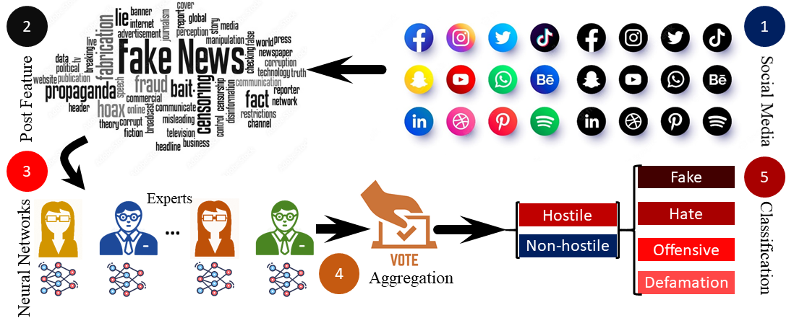

### Publication
Ensemble Classifier for Hindi Hostile Content Detection, 
By : Angana Chakraborty, Subhankar Joardar, and Arif Ahmed Sekh
In: Consideration

[Link to The Paper](https:xxxx)

### Dataset Description
To be Added
### License

Copyright © 2023 Sk. Arif Ahmed

The content of this repository is bound by the following licenses:

- The documents and data are licensed under the MIT license.
